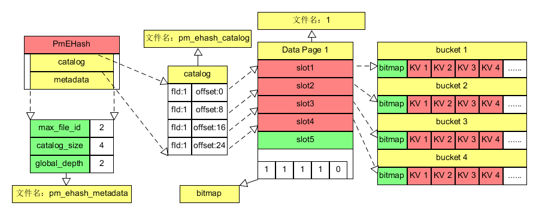

# 2020-DBMS-project
This is the final project of 2020 DBMS course in SYSU
--
## 项目概述
本次课程设计要求实现一个课本上所讲解的可扩展哈希的持久化实现，底层持久化是在模拟的NVM硬件上面进行。

## <font color= red>注意事项</font>
+ 每个小组独立完成，切忌相互抄袭，小组的仓库地址和代码不要分享给其他小组
+ 所有小组代码将进行软件查重，重复率过高将视为抄袭，雷同两个小组直接0分处理
+ 小组成员在github上的代码贡献和小组总成绩决定其分数

## 涉及知识点
+ 可扩展哈希
+ 简单的NVM编程
+ gtest单元测试
+ 编写makefile编译
+ github团队编程
+ 定长页表设计和使用
+ 简单的页表文件空间管理

## 项目讲解
项目是一个可扩展哈希，存储定长键值对形式的数据，提供给外界的接口只有对键值对的增删改查操作，底层存储与模拟NVM硬件进行交互，将数据持久存储在文件中，重启时能够重新恢复可扩展哈希的存储状态。

## 文件夹说明：
+ data: 存放可扩展哈希的相关数据页表，目录以及元数据，即存放PmEHash对象数据文件的文件夹。**编写代码时记得将代码中的数据目录设置为这个目录**
+ gtest: Google Test源文件，不需要动
+ include: 项目相关头文件
+ PMDK-dependency: PMDK相关依赖
+ src: 项目相关源文件
+ task: 课程设计任务文档说明
+ test: 项目需要通过的测试源文件
+ workload: YCSB benchmark测试的数据集

## 项目总体步骤
1. 安装PMDK
2. 用内存模拟NVM
3. 实现代码框架的功能并进行简单的Google test，运行并通过ehash_test.cpp中的简单测试
4. 编写main函数进行YCSB benchmark测试，读取workload中的数据文件进行增删改查操作，测试运行时间并截图性能结果。

## 需要编写的文件说明
1. src下所有源文件以及makefile
2. src下自编写ycsb读取workload进行性能测试
3. 如增添源文件，修改test下的makefile进行编译
4. include中所有头文件进行自定义增添和补充

## 架构示意图


## 代码说明
大家关注增删改查接口，恢复功能接口以及数据页的功能实现即可，其他函数和数据结构都是服务于它们的，所以项目里private的接口函数最好能用项目规定的，不用也可以自定义自己的函数和数据结构，前提是要解释清楚功能作用。

### 插入操作
插入成功返回0，失败返回-1。不允许插入具有相同键的数据

```
int insert(kv_pair):
    if search(kv_pair.key) == 0:
        return -1;
    bucket = getFreeBucket(kv_pair.key);
    freePlace = getFreeKvPlace(bucket);
    *freePlace = kv_pair;
    persit(freePlace);
    return 0;
```

```
pm_bucket* getFreeBucket(key):  
    获得要插入的桶，如果满则要进行分裂操作splitBucket(bucket_id)，返回新桶
```

```
kv* getFreeKvSlot(bucket):  
    获得桶内第一个空的插入的槽位
```
### 删除操作
删除成功返回0，失败返回-1

```
int remove(key):  
    找存放的bucket;  
    找目标键值对；
    存在则将对应位图置0，返回0；
    不存在返回-1；
    桶空后进行mergeBucket，回收对应内存；
```

### 更新操作
更新成功返回0，失败返回-1
```
int update(lkv_pair):
    找目标键值对
    不存在就返回-1
    存在就就地更新目标键值对，返回0

```

### 查找操作
查找成功返回0，失败返回-1。目标值放在参数中按引用返回
```
int search(key, & return_val):
    找到目标桶
    找目标键值对
    不存在返回-1
    存在则将值放入return_val，并返回0
```

### 初始化和恢复
新建或重新载入旧的哈希都是通过PmEHash的默认构造函数进行。目标数据文件夹下无可扩展哈希的数据文件，则新建一个可扩展哈希以及相关管理文件，即元数据文件和目录。假设存在旧的可扩展哈希，则通过pmem的内存映射打开，恢复原可扩展哈希的状态。

```
PmEHash():
    数据文件夹下无旧哈希的数据：
        新建目录和元数据文件并映射
    数据文件夹下有旧哈希：
        recover()

recover():
    读取metadata文件中的数据并内存映射
    读取catalog文件中的数据并内存映射
    读取所有数据页文件并内存映射
    设置可扩展哈希的桶的虚拟地址指针
    初始化所有其他可扩展哈希的内存数据

```

## YCSB测试
这是一个键值数据库性能测试benchmark，数据文件我已放在workload文件夹下。
1. 220w-rw-50-50-load.txt表示里面的数据量时220w，读写比位50比50，是load阶段的数据集。
1. **如何使用**：YCSB测试分为load和run阶段，load是预先初始化数据库，全是插入操作，run是真正运行性能测试，有增删改查操作。所以进行测试时需要先读取load的数据集进行数据库初始化，然后再读取run阶段的数据集进行实际增删改查操作。
1. INSERT 6284781860667377211是数据集的数据形式，前面表示操作插入，后面表示数据。由于我们的键长度只有8字节，所以加载后面数据时对应复制前8字符长度进对应的键的变量即可

## Google Test
gtest是谷歌的C单元测试的框架，能对我们的项目进行简单的单元测试。测试代码我已经写好，项目完成后在test文件夹下进行makefile，然后运行测试ehash_test，通过所有测试即可。test下的makefile我只加了pm_ehash的编译链接，你们写完data_page或其他自己添加的源文件后记得修改makefile进行编译编译链接，否则出错。

## 关键数据文件
### 可扩展哈希的元数据文件pm_ehash_metadata
记录恢复可扩展哈希的关键数据，由ehash_metadata数据结构表示，存于pm_ehash_metadata文件中。catalog_size用于指示目录中有多少项，根据项数计算catalog文件的大小然后进行映射打开。max_file_id用于指示数据页文件号，下一个可用的文件号。

### 可扩展哈希的数据页文件
文件名即是分配的文件号1-N，是项目中需要进行自己设计的页表的存储文件，在初始化时需要将所有数据页内存映射，然后通过字节偏移赋予可扩展哈希可用的数据的虚拟地址。可扩展哈希的每个桶存储在数据页的槽位中。当生成新桶时要从数据页中分配可用的槽位。当桶被释放时要回收槽位的空间。

### 可扩展哈希目录文件pm_ehash_catalog
存储哈希桶的文件地址pm_address的数组文件。从metadata获得目录的元素个数后可以计算其大小进行打开，里面存储所有桶的pm_address。

## 实现中问题的解决方案
### 位图bitmap的作用
与定长页表设计中的位图作用一样，指示对应槽位是否占用，1表占用0表空。哈希桶中每个slot也有bitmap指示slot是否为空，删除时可不删除原数据，将bitmap置0即可。

### 数据页文件名如何赋予
每个数据页的文件吗用无符号整型数1-N表示，通过ehash_metadata中的max_file_id记录下一个可以分配的文件号，分配一次递增max_file_id即可。

### 文件空间地址pm_address
这个数据结构用于定位指定数据页上的指定位移的数据。如fileId为1，offset为100表示数据位于文件号为1的数据页上的第100字节处。

### 可扩展哈希如何获得桶的存储空间以及管理数据页的空闲空间
可扩展哈希通过getNewBucket获得空闲的桶空间，这些空间由free_list队列统一记录，没有空闲空间就申请新的数据页，返回可用空闲空间地址并出队列。当生成新的数据页时，将所有产生的空闲空间地址记录到free_list中。当桶空时，将对应的空闲空间记录回free_list。重新载入可扩展哈希时，要将所有的数据页空闲槽位地址加入free_list。

### 如何记录虚拟地址以及对应的文件地址pm_address的对应关系
通过PmEHash中的vAddr2pmAddr映射数据结构进行记录，每个虚拟地址都应记录其对应的文件地址。

### To Be Continued
项目介绍有不懂的地方向TA请教，普遍性问题我会更新说明文档，但是如果文档有说明的地方就别再问了。
